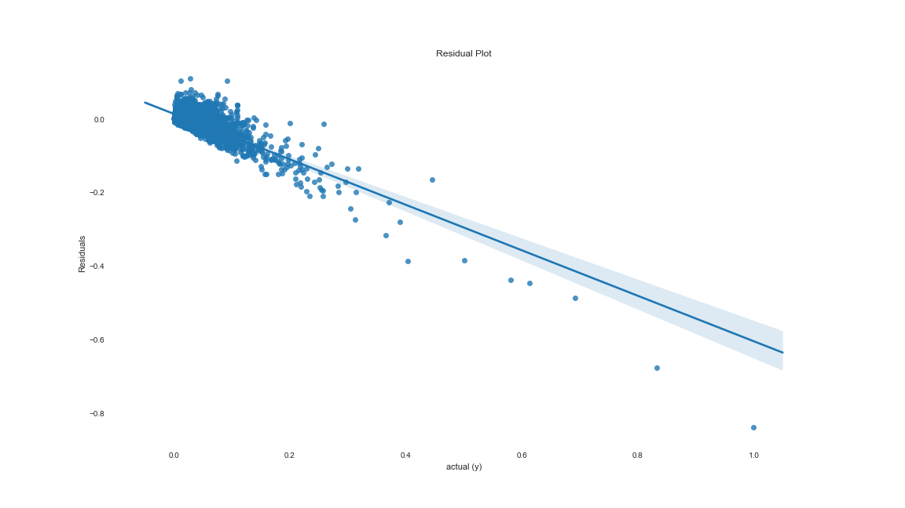
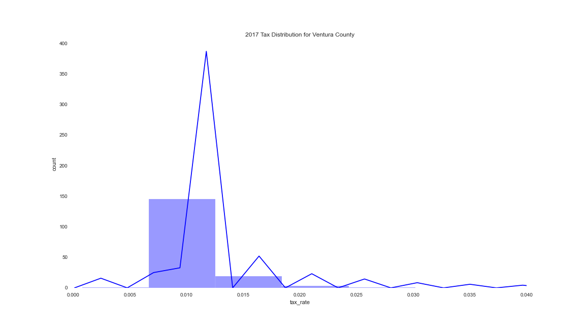

# Estimate Home Value - Predicting Home Prices Using Linear Regression

### *The Report*

> Here's the link to the deliverable report requested from the team. It contains the slides, but not the verbal portion of the presentation. https://drive.google.com/file/d/1eMrsrx6Vs1rHDuicfFpt9uNJNoz8g3LU/view?usp=sharing

## *Background*:

> We want to be able to predict the values of single unit properties that the tax district assesses using the property data from those whose last transaction was during the "hot months" (in terms of real estate demand) of May and June in 2017. We also need some additional information outside of the model.
> Zach lost the email that told us where these properties were located. Ugh, Zach :-/. Because property taxes are assessed at the county level, we would like to know what states and counties these are located in.
> We'd also like to know the distribution of tax rates for each county.
The data should have the tax amounts and tax value of the home, so it shouldn't be too hard to calculate. Please include in your report to us the distribution of tax rates for each county so that we can see how much they vary within the properties in the county and the rates the bulk of the properties sit around.
> Note that this is separate from the model you will build, because if you use tax amount in your model, you would be using a future data point to predict a future data point, and that is cheating! In other words, for prediction purposes, we won't know tax amount until we know tax value.

## *Other notes*:

- For the first iteration of your model, use only square feet of the home, number of bedrooms, and number of bathrooms to estimate the properties assessed value, 'taxvaluedollarcnt'. You can expand this to other fields after you have completed an mvp (minimally viable product).
- You will want to read and re-read the requirements given by your stakeholders to be sure you are meeting all of their needs and representing it in your data, report and model.
- You will want to do some data validation or QA (quality assurance) to be sure the data you gather is what you think it is.
- You will want to make sure you are using the best fields to represent square feel of home, number of bedrooms and number of bathrooms. best => the most accurate and available information. You will need to do some data investigation in the database and use your domain expertise to make some judgement calls.
Specification

## *Goals*

Your customer is the zillow data science team. State your goals as if you were delivering this to Zillow. You will be communicating in a more concise way, and very clearly, the goals as you understand them and as you have taken and acted upon through your research.

## *Deliverables*

**What should the zillow team expect to receive from you?**

1. A report (in the form of a presentation, both verbal and through a slides)

The report/presentation slides should summarize your findings about the drivers of the Zestimate error. This will come from the analysis you do during the exploration phase of the pipeline. In the report, you will have charts that visually tell the story of what is driving the errors.

2. A github repository containing your jupyter notebook that walks through the pipeline along with the .py files necessary to reproduce your model.

*model must be reproducible by someone with their own env.py file*

## *The Pipeline*

### PROJECT PLANNING & README

> Brainstorming ideas, hypotheses, related to how variables might impact or relate to each other, both within independent variables and between the independent variables and dependent variable, and also related to any ideas for new features you may have while first looking at the existing variables and challenge ahead of you.

> Have a detailed README.md file for anyone who wants to check out your project. In this file should be a description of what the project is, and any instructions necessary for someone else to clone your project and run the code on their own laptop.

### ACQUIRE:

**Goal**: leave this section with a dataframe ready to prepare.

The ad hoc part includes summarizing your data as you read it in and begin to explore, look at the first few rows, data types, summary stats, column names, shape of the data frame, etc.

acquire.py: The reproducible part is the gathering data from SQL.

### PREP:

**Goal**: leave this section with a dataset that is ready to be analyzed. Data types are appropriate, missing values have been addressed, as have any data integrity issues.

The ad hoc part includes plotting the distributions of individual variables and using those plots to identify outliers and if those should be handled (and if so, how), identify unit scales to identify how to best scale the numeric data, as well as finding erroneous or invalid data that may exist in your dataframe.

Add a data dictionary in your notebook that defines all fields used in either your model or your analysis, and answers the question: why did you use the fields you used, e.g. why did you use bedroom_field1 over bedroom_field2, not why did you use number of bedrooms!

prep.py: The reproducible part is the handling of missing values, fixing data integrity issues, changing data types, etc.

### SPLIT & SCALE:

**Goal**: leave this section with 2 dataframes (train & test) and scaled data

split_scale.py: split data, scale data (create scaler, fit the scaler to train and transform the train and test using that scaler)

### DATA EXPLORATION

**Goal**: Address each of the questions you posed in your planning and brainstorming and any others you have come up with along the way through visual or statistical analysis.

When you have completed this step, you will have the findings from your analysis that will be used in your final report, answers to specific questions your customers has asked, and information to move forward toward building a model.

Run at least 1 t-test and 1 correlation test (but as many as you need!)

Visualize all combinations of variables in some way(s).

What independent variables are correlated with the dependent? (this is good)

Which independent variables are correlated with other independent variables? (this is not so good and needs to be addressed)

Summarize your takeaways and conclusions.

### FEATURE SELECTION

**Goal**: leave this section with a dataframe with the features to be used to build your model.

Are there new features you could create based on existing features that might be helpful?

You could use feature selection techniques to see if there are any that are not adding value to the model.

feature_selection.py: to run whatever functions need to be run to end with a dataframe that contains the features that will be used to model the data.

### MODELING & EVALUATION

**Goal**: develop a regression model that performs better than a baseline.

You must evaluate a baseline model, and show how the model you end up with performs better than that.

model.py: will have the functions to fit, predict and evaluate the model

Your notebook will contain various algorithms and/or hyperparameters tried, along with the evaluation code and results, before settling on the final algorithm.

Be sure and evaluate your model using the standard techniques: plotting the residuals, computing the evaluation metric (SSE, RMSE, and/or MSE), comparing to baseline, plotting \(y\)by \(^y\)

### SUMMARY

## *SQL Data Acquisition*
Must use your own env file to access data.

* Choose home transaction during May and June 2017 only.

* Single-unit residential properties only
***

## *Hypothesis Testing*
Lets do some hypothesis testing 

* \($H_0$\): there is no relationship between home values and number of bedrooms, bathrooms and square_feet.

* \($H_a$\): There is a relationship between home values and number of bedrooms, bathrooms and square_feet
***

## *Technical Skills used*

* Python
* SQL
* Various data science libraries (Pandas, Numpy, Matplotlib etc)
* Stats (Hypothesis testing, correlation tests)
* Linear Regression (Single Linear Regression, Multiple Linear Regression)
* PowerPoint (presentation creation)
* Photoshop (create gif for heatmap layer from gmaps)
***

## *Executive Summary*
* Everyone already knows, but `Location! Location! Location!` is so important in the final product for any real estate application
* Location, square footage and neighborhood (aort of location, but more specific ) are major drivers of home value
* Other classification methods should help improve the accuracy of models.
* Heat map of the location drill down for home values

* A plot of the residuals for the linear model that beat the baseline

* Tax Distribution Graphs

